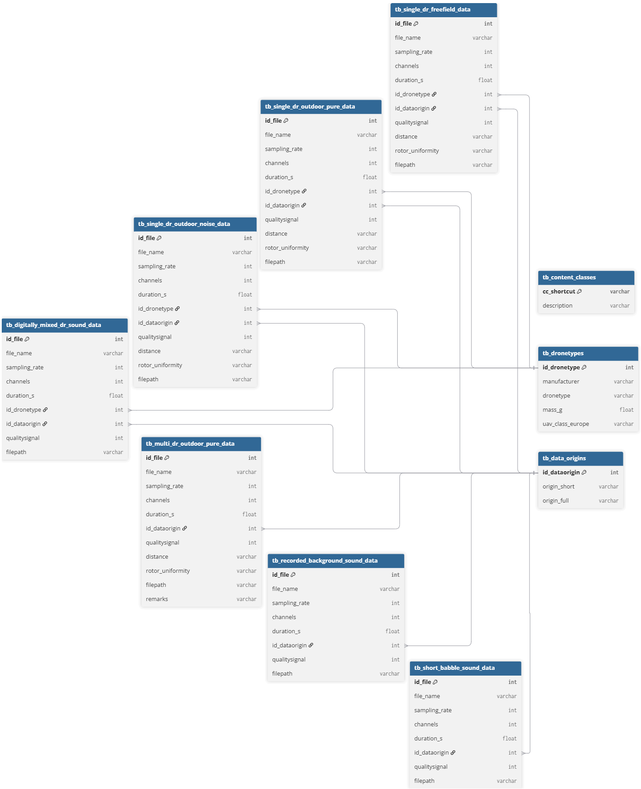
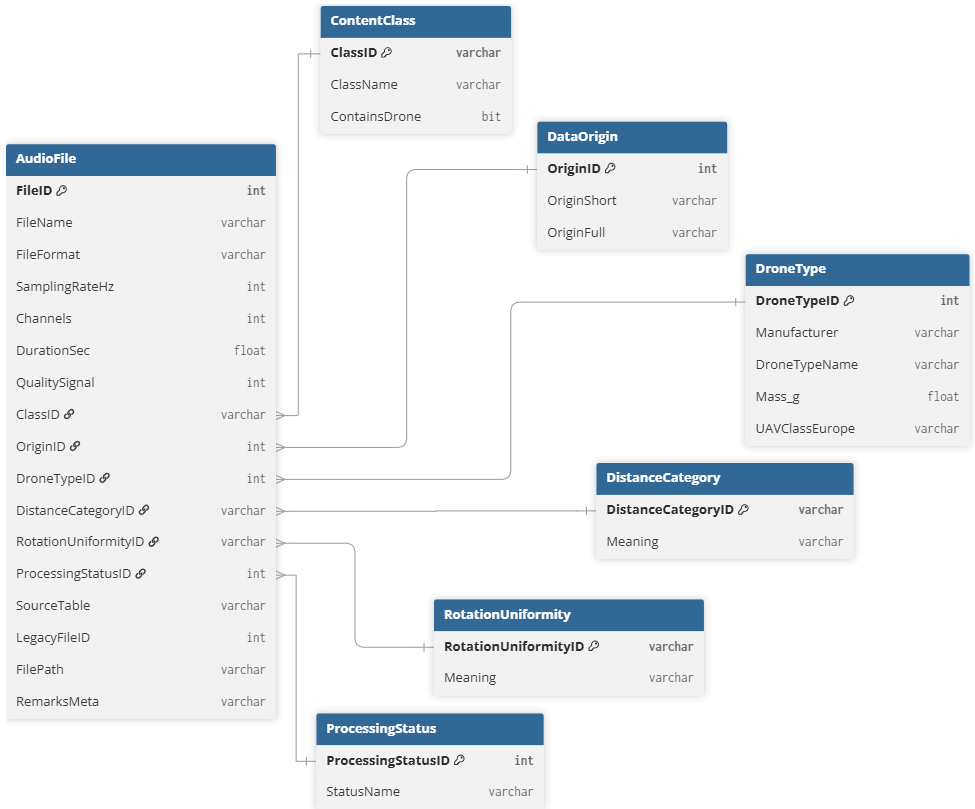

# AuDroK Metadata Database

This repository contains SQL Server scripts used to reconstruct a normalized metadata database for the AuDroK drone acoustic dataset.

The database was prepared as part of a master's thesis focused on machine learning methods for drone detection based on acoustic signals.

## Purpose

The original metadata structure was distributed across several source tables. This made it difficult to perform consistent queries over the entire dataset. The goal of this repository is to provide a cleaned and normalized relational database structure that improves data consistency, enables global querying, and preserves the original metadata records.

The restructuring does not modify the original audio files. It only changes the way metadata are organized and loaded into a relational database.

## Database layers

The database build process follows a staged pipeline:

```text
RAW -> STAGING -> ETL -> FINAL
```

### RAW

The RAW layer stores source metadata tables in a structure close to the original AuDroK database layout.  
At this stage, the data are loaded without normalization or semantic corrections.

The purpose of this layer is to preserve the original metadata structure and provide a reproducible starting point for the migration process.

### STAGING

The STAGING layer combines all RAW source tables into one unified structure.

This layer is responsible for basic cleaning and standardization, including:

- trimming text values,
- converting sampling rate values to Hz,
- preserving legacy source identifiers,
- assigning normalized content classes based on source tables,
- standardizing processing status values,
- standardizing distance and rotation uniformity codes,
- converting invalid duration values to `NULL`,
- converting invalid signal quality values to `NULL`,
- validating duplicate source records.

The staging layer does not represent the final analytical schema. It is an intermediate layer used to prepare the metadata for normalized loading.

### ETL

The ETL layer validates mappings between staging values and final lookup tables.  
It then loads the normalized final table `dronesounds.AudioFile`.

This step checks whether all records can be mapped to:

- content classes,
- data origins,
- drone types,
- distance categories,
- rotation uniformity categories,
- processing statuses.

The ETL process also validates final row counts, required fields, numeric ranges, lookup relationships, and the no-drone convention.

### FINAL

The FINAL layer contains the normalized database schema used for querying and analysis.

The main table is:

```text
dronesounds.AudioFile
```

It stores one row per metadata record and references descriptive lookup tables through foreign keys.

The final schema is designed to support consistent queries across the entire dataset, regardless of the original RAW source table.

## Repository structure

```text
DroneSoundsDB/
│
├── schema/
│   ├── 00_create_database.sql
│   ├── 00_create_schema.sql
│   ├── 01_lookup_tables.sql
│   ├── 02_core_tables.sql
│   ├── 03_constraints.sql
│   └── 04_indexes.sql
│
├── seeds/
│   ├── 01_content_classes.sql
│   ├── 02_data_origins.sql
│   ├── 03_drone_types.sql
│   ├── 04_distance_categories.sql
│   ├── 05_rotation_uniformity.sql
│   └── 06_processing_statuses.sql
│
├── raw/
│   ├── 00_create_raw_tables.sql
│   ├── 99_run_all_raw_loads.sql
│   └── data/
│       ├── 01_insert_digitally_mixed.sql
│       ├── 02_insert_multi_dr_outdoor.sql
│       ├── 03_insert_background.sql
│       ├── 04_insert_babble.sql
│       ├── 05_insert_freefield.sql
│       ├── 06_insert_outdoor_noise.sql
│       └── 07_insert_outdoor_pure.sql
│
├── staging/
│   ├── 00_create_staging_tables.sql
│   ├── 01_create_unified_source_view.sql
│   ├── 02_load_staging_from_view.sql
│   ├── 03_clean_trim.sql
│   ├── 04_standardize_units.sql
│   ├── 05_standardize_text_values.sql
│   └── 06_validate_staging.sql
│
├── etl/
│   ├── 00_prepare_etl.sql
│   ├── 01_map_content_classes.sql
│   ├── 02_map_origins.sql
│   ├── 03_map_drone_types.sql
│   ├── 04_map_rotation_uniformity.sql
│   ├── 05_map_distance_categories.sql
│   ├── 06_map_processing_status.sql
│   ├── 07_load_audio_files.sql
│   ├── 08_validate_final_load.sql
│   └── 99_run_full_etl.sql
│
├── maintenance/
│   └── 01_diagnostic_queries.sql
│
├── run/
│   ├── 00_full_rebuild.sql
│   ├── 01_run_schema.sql
│   ├── 02_run_seeds.sql
│   ├── 03_run_raw.sql
│   ├── 04_run_staging.sql
│   ├── 05_run_etl.sql
│   ├── 06_finalize_schema.sql
│   └── 07_run_maintenance.sql
│
├── docs/
│   ├── original_database_schema.png
│   └── final_database_schema.png
│
├── README.md
├── .gitignore
└── LICENSE
```

## Requirements

The scripts were prepared for Microsoft SQL Server.

Recommended environment:

- Microsoft SQL Server 2022 or newer,
- SQL Server Management Studio or Azure Data Studio,
- `sqlcmd` command line utility,
- Windows Authentication or another configured SQL Server login.

The run scripts use SQLCMD include commands:

```sql
:r
```

Therefore, when executing the scripts in SQL Server Management Studio, SQLCMD Mode must be enabled.

In SSMS:

```text
Query -> SQLCMD Mode
```

## Rebuilding the database

Open PowerShell in the repository root directory:

```powershell
cd "path\to\DroneSoundsDB"
```

Run the scripts in the following order:

```powershell
sqlcmd -S YOUR_SERVER_NAME -E -C -b -i .\run\01_run_schema.sql
sqlcmd -S YOUR_SERVER_NAME -E -C -b -d DroneSoundsDB -i .\run\02_run_seeds.sql
sqlcmd -S YOUR_SERVER_NAME -E -C -b -d DroneSoundsDB -i .\run\03_run_raw.sql
sqlcmd -S YOUR_SERVER_NAME -E -C -b -d DroneSoundsDB -i .\run\04_run_staging.sql
sqlcmd -S YOUR_SERVER_NAME -E -C -b -d DroneSoundsDB -i .\run\05_run_etl.sql
sqlcmd -S YOUR_SERVER_NAME -E -C -b -d DroneSoundsDB -i .\run\06_finalize_schema.sql
sqlcmd -S YOUR_SERVER_NAME -E -C -b -d DroneSoundsDB -i .\run\07_run_maintenance.sql
```

The `-b` option stops execution when an SQL error occurs.

## Expected final result

After a successful rebuild, the final table should contain:

```text
14420 records
```

The expected content class distribution is:

```text
A     3338
B      224
C      135
E        8
G      606
H      109
I    10000
```

The distribution can be verified with:

```sql
SELECT
    ClassID,
    COUNT(*) AS RecordCount
FROM dronesounds.AudioFile
GROUP BY ClassID
ORDER BY ClassID;
```

## Content classes

The final database uses the following content class dictionary:

| ClassID | Meaning |
|---|---|
| A | Single drone free-field sound |
| B | Single drone outdoor sound, pure |
| C | Single drone outdoor sound with noise or disturbances |
| D | Multiple drone free-field sound |
| E | Multiple drone outdoor sound, pure |
| F | Multiple drone outdoor sound with noise or disturbances |
| G | Digitally mixed drone sounds |
| H | Recorded background sounds only |
| I | Recorded short-period babble sounds |

Classes `D` and `F` are preserved in the dictionary for consistency with the AuDroK class structure, even if they do not occur in the currently loaded metadata.

## Important modeling decisions

### Global and legacy identifiers

The original `File_ID` values are not globally unique across all source tables.  
For this reason, the final `dronesounds.AudioFile` table uses two identifiers:

- `FileID` — a new global identifier generated during ETL,
- `LegacyFileID` — the original identifier from the source RAW table.

The column `SourceTable` stores the name of the original RAW table.  
The pair:

```text
SourceTable + LegacyFileID
```

uniquely identifies the original source record.

### No-drone convention

The database uses the following convention:

```text
DroneTypeID = 0 -> No Drone
```

This value is used only for classes that do not contain drone recordings, such as:

```text
H -> Recorded background sounds only
I -> Recorded short-period babble sounds
```

Multi-drone recordings are not represented as `DroneTypeID = 0`.  
They are represented using a separate drone type entry.

### Multi-drone recordings

Some records contain more than one drone in a single recording.  
Because the final `AudioFile` table stores one `DroneTypeID` per record, multi-drone recordings are represented by a dedicated drone type entry.

This avoids assigning `DroneTypeID = 0` to recordings that actually contain drones.

### Invalid or missing metadata

Some source metadata values required cleaning before loading into the final schema.

Examples:

- non-positive duration values are treated as missing duration metadata and converted to `NULL`,
- signal quality values outside the accepted range are treated as missing quality metadata and converted to `NULL`,
- combined rotation uniformity codes are standardized,
- unknown distance codes are mapped to the unknown/unclear category,
- processing status values are standardized.

The final schema uses constraints to prevent invalid values from being loaded into the normalized table.

## Database diagrams

The repository includes database diagrams in the `docs/` directory.

### Original database structure



### Final database structure



### Migration pipeline


## Validation

The ETL process performs several validation steps before and after loading the final table.

The validation includes:

- checking whether all lookup mappings are available,
- checking row count consistency between staging and final tables,
- checking duplicate global identifiers,
- checking duplicate legacy source identifiers,
- checking required fields,
- checking numeric ranges,
- checking foreign key relationships,
- checking the no-drone convention.

After a successful ETL run, the following checks should pass:

```text
Row count validation passed
No duplicate FileID values found
No duplicate legacy source identifiers found
Required field validation passed
Numeric range validation passed
Lookup relationship validation passed
No Drone convention validation passed
Final AudioFile validation completed successfully
```

## Diagnostic queries

The file:

```text
maintenance/01_diagnostic_queries.sql
```

contains read-only diagnostic queries that can be used to inspect the final database after loading.

These queries summarize the dataset by:

- content class,
- drone type,
- data origin,
- processing status,
- sampling rate,
- distance category,
- rotation uniformity,
- signal quality,
- duration statistics,
- selected consistency checks.

## What this repository contains

This repository contains:

- SQL Server schema creation scripts,
- lookup table seed scripts,
- RAW metadata insert scripts,
- staging scripts,
- ETL scripts,
- validation scripts,
- diagnostic queries,
- database diagrams.

## What this repository does not contain

This repository does not contain the original audio files.

The restructuring affects only the organization and loading of metadata.  
It does not modify the source audio recordings.

## License

The SQL scripts in this repository are released under the MIT License.

The original AuDroK dataset and source metadata remain subject to their original licenses, terms of use, and citation requirements.
